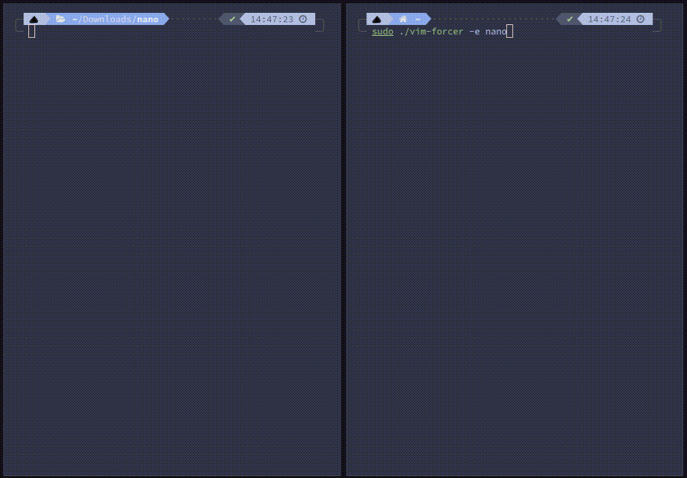

# vim-forcer

vim-forcer watches for attempts to open nano (or any configured editor) and replaces them with vim, transparently, before the user ever sees the wrong editor.

## Disclaimer

This tool kills processes and hijacks terminals system-wide. Do not run it on any critical system. It is intended for educational purposes only. The developer takes no responsibility for any damage or misuse.

## How it works

**Detection**: vim-forcer loads an eBPF program that attaches to the `execve` syscall tracepoint. Every time a process is exec'd, the kernel-side program checks the executable basename against a list of watched editors. If there is a match, it sends an event to userspace via a ring buffer, carrying the PID and the file argument.

**Takeover**: once userspace receives an event, it:

1. Resolves the terminal from `/proc/[pid]/fd/0` and the file path from `/proc/[pid]/cwd`.
2. Sends `SIGSTOP` to the parent shell so it does not reclaim the terminal.
3. Sends `SIGKILL` to the intercepted editor process.
4. Spawns a new shell on the same terminal running `exec vim '[file]'`.
5. Waits for vim to exit, then sends `SIGCONT` to the parent shell.

The result is a seamless swap with no visible gap (I am still trying to get rid of the `killed nano` message...).
It also tracks and stores the number of swaps peformed per uid, if you want to put a wall of shame in your motd or somewhere else.

## Demo



## AI Assistance Disclosure

This project has been developed with assistance from AI-powered coding tools for code generation and documentation. All code has been reviewed, tested, and verified by me before inclusion.

---


# Built with aya-template (https://github.com/aya-rs/aya-template)

## Prerequisites

1. stable rust toolchains: `rustup toolchain install stable`
1. nightly rust toolchains: `rustup toolchain install nightly --component rust-src`
1. (if cross-compiling) rustup target: `rustup target add ${ARCH}-unknown-linux-musl`
1. (if cross-compiling) LLVM: (e.g.) `brew install llvm` (on macOS)
1. (if cross-compiling) C toolchain: (e.g.) [`brew install filosottile/musl-cross/musl-cross`](https://github.com/FiloSottile/homebrew-musl-cross) (on macOS)
1. bpf-linker: `cargo install bpf-linker` (`--no-default-features` on macOS)

## Build & Run

Use `cargo build`, `cargo check`, etc. as normal. Run your program with:

```shell
cargo run --release
```

Cargo build scripts are used to automatically build the eBPF correctly and include it in the
program.

## Cross-compiling on macOS

Cross compilation should work on both Intel and Apple Silicon Macs.

```shell
CC=${ARCH}-linux-musl-gcc cargo build --package vim-forcer --release \
  --target=${ARCH}-unknown-linux-musl \
  --config=target.${ARCH}-unknown-linux-musl.linker=\"${ARCH}-linux-musl-gcc\"
```
The cross-compiled program `target/${ARCH}-unknown-linux-musl/release/vim-forcer` can be
copied to a Linux server or VM and run there.

## License

With the exception of eBPF code, vim-forcer is distributed under the terms
of either the [MIT license] or the [Apache License] (version 2.0), at your
option.

Unless you explicitly state otherwise, any contribution intentionally submitted
for inclusion in this crate by you, as defined in the Apache-2.0 license, shall
be dual licensed as above, without any additional terms or conditions.

### eBPF

All eBPF code is distributed under either the terms of the
[GNU General Public License, Version 2] or the [MIT license], at your
option.

Unless you explicitly state otherwise, any contribution intentionally submitted
for inclusion in this project by you, as defined in the GPL-2 license, shall be
dual licensed as above, without any additional terms or conditions.

[Apache license]: LICENSE-APACHE
[MIT license]: LICENSE-MIT
[GNU General Public License, Version 2]: LICENSE-GPL2
